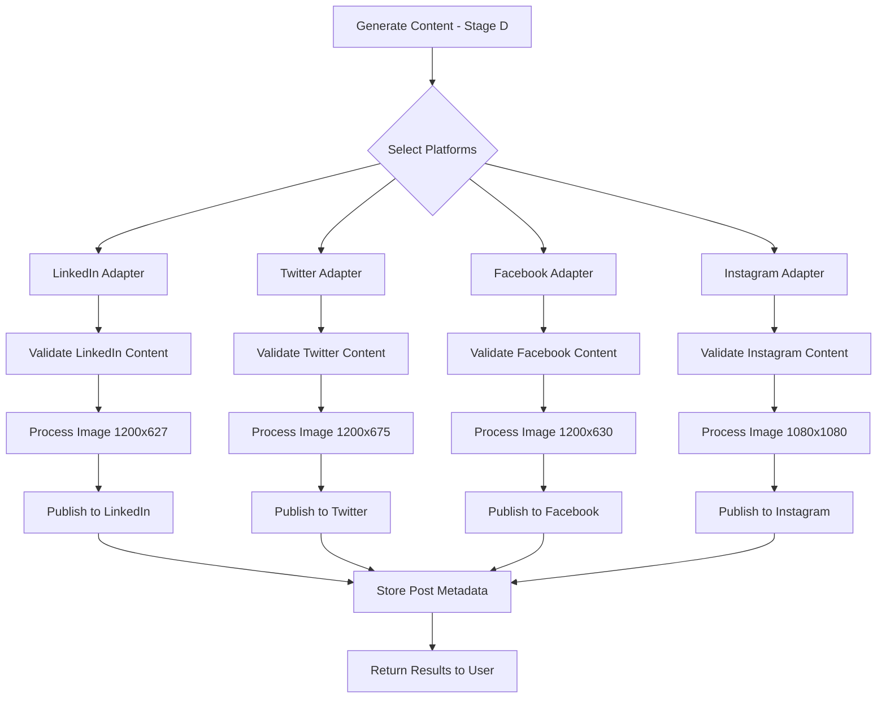

# STAGE E: MULTI-PLATFORM PUBLISHING SYSTEM - APPROVED PLAN

**Version:** 1.0.0
**Status:** ✅ APPROVED - Production Ready
**Date:** November 10, 2025
**Stage:** E of 12
**Dependencies:** Stage D (Content Generation) must be complete

---

## Table of Contents

1. [System Overview](#1-system-overview)
2. [Platform Specifications](#2-platform-specifications)
3. [Platform Adapters Architecture](#3-platform-adapters-architecture)
4. [OAuth & Authentication](#4-oauth--authentication)
5. [Cross-Platform Content Strategy](#5-cross-platform-content-strategy)
6. [Publishing Workflow](#6-publishing-workflow)
7. [Image Processing Pipeline](#7-image-processing-pipeline)
8. [Analytics & Tracking](#8-analytics--tracking)
9. [APIs & Integration](#9-apis--integration)
10. [Cost Analysis](#10-cost-analysis)
11. [Implementation Roadmap](#11-implementation-roadmap)
12. [Security & Compliance](#12-security--compliance)
13. [Testing Strategy](#13-testing-strategy)

---

## 1. System Overview

### 1.1 Purpose

Enable DIFY-AGENT to publish social media content to multiple platforms (LinkedIn, Twitter/X, Facebook, Instagram) with platform-specific optimizations while maintaining brand consistency.

### 1.2 Core Requirements

**Must Have:**
- ✅ Publish to 4 platforms: LinkedIn, Twitter/X, Facebook, Instagram
- ✅ Platform-specific content adaptation (text length, image sizes, hashtags)
- ✅ OAuth 2.0 authentication for all platforms
- ✅ Image aspect ratio conversion with smart cropping
- ✅ Multi-tenant token isolation (each customer's credentials private)
- ✅ Error handling and retry logic
- ✅ Post-publish analytics tracking
- ✅ Platform rate limit management

**Should Have:**
- Cross-platform scheduling (publish to all platforms simultaneously)
- Best time to post recommendations
- A/B testing across platforms
- Platform-specific hashtag optimization

**Won't Have (Phase 2):**
- Video publishing (static images only for now)
- Stories/Reels (feed posts only)
- TikTok, Pinterest, YouTube (future platforms)

### 1.3 Architecture Overview

```
Content Generator (Stage D)
        ↓
Platform Adapter Layer
    ↓           ↓           ↓           ↓
LinkedIn    Twitter/X   Facebook   Instagram
Adapter     Adapter     Adapter     Adapter
    ↓           ↓           ↓           ↓
Platform APIs (OAuth 2.0 authenticated)
```

**Key Components:**
1. **Content Generator** (Stage D): Produces platform-agnostic content
2. **Platform Adapters**: Transform content to platform-specific format
3. **OAuth Manager**: Handles authentication, token refresh, storage
4. **Image Processor**: Resizes/crops images for each platform
5. **Publishing Service**: Executes API calls with retry logic
6. **Analytics Tracker**: Stores post metadata and retrieves metrics

### 1.4 Integration with Stage D

**Stage D Output → Stage E Input:**

Stage D produces:
```json
{
  "content": {
    "text": "Full-length post text (up to 3000 chars)",
    "image_url": "https://r2.example.com/generated-image.png",
    "cta": "Learn more at nextdaysteel.co.uk",
    "hashtags": ["#Construction", "#Steel", "#B2B", "#Manufacturing"],
    "product_mention": "A142 Mesh"
  },
  "metadata": {
    "intent": "product_promotion",
    "brand_voice_score": 0.92,
    "guards_passed": 7
  }
}
```

Stage E adapts this to each platform and publishes.

---

## 2. Platform Specifications

### 2.1 LinkedIn

**Platform:** LinkedIn Organic Posts
**API:** LinkedIn Marketing Developer Platform v2
**OAuth:** OAuth 2.0 with `w_member_social` scope

**Content Specifications:**
- **Text Length:** 3,000 characters max (recommended: 150-300 for engagement)
- **Image Dimensions:** 1200 x 627 px (1.91:1 aspect ratio)
- **Image File Size:** 5 MB max
- **Image Formats:** JPG, PNG, GIF (no animated GIFs in feed)
- **Hashtags:** 3-5 recommended (max 10)
- **Links:** Auto-preview for first URL in post
- **Video:** 5 sec - 10 min (not in Phase 1)

**API Endpoints:**
```http
POST https://api.linkedin.com/v2/ugcPosts
POST https://api.linkedin.com/v2/assets?action=registerUpload
```

**Rate Limits:**
- 100 API calls per user per day (throttle per member)
- 500 API calls per application per day

**Best Practices:**
- Post on weekdays (Tue-Thu, 8am-10am, 12pm-2pm)
- Use professional tone
- Include rich media (images boost engagement 2x)
- 3-5 hashtags sweet spot

**Publishing Flow:**
1. Register image upload → Get upload URL
2. Upload image binary to asset URL
3. Wait for asset processing (poll status)
4. Create UGC post with asset URN

### 2.2 Twitter/X

**Platform:** Twitter/X (formerly Twitter)
**API:** Twitter API v2
**OAuth:** OAuth 2.0 with `tweet.read`, `tweet.write`, `users.read` scopes

**Content Specifications:**
- **Text Length:** 280 characters (4,000 for Twitter Blue, but stick to 280 for compatibility)
- **Image Dimensions:** 1200 x 675 px (16:9 aspect ratio) or 1200 x 1200 px (1:1)
- **Image File Size:** 5 MB max (JPG, PNG, GIF)
- **Image Formats:** JPG, PNG, GIF, WEBP
- **Hashtags:** 1-2 recommended (max 3-5, more hurts engagement)
- **Links:** t.co link shortener (23 chars counted regardless of URL length)
- **Video:** 140 sec max (not in Phase 1)

**API Endpoints:**
```http
POST https://api.twitter.com/2/tweets
POST https://upload.twitter.com/1.1/media/upload.json
```

**Rate Limits:**
- 200 tweets per 24 hours (app rate limit)
- 50 tweets per 24 hours per user (conservative to avoid spam detection)

**Best Practices:**
- Post at 8am, 12pm, 5pm on weekdays
- Use concise, punchy language
- 1-2 hashtags max
- Engage with replies within 1 hour

**Publishing Flow:**
1. Upload image via media/upload endpoint → Get media_id
2. Wait for media processing completion
3. Create tweet with media_id attached

### 2.3 Facebook

**Platform:** Facebook Business Pages
**API:** Facebook Graph API v18.0
**OAuth:** OAuth 2.0 with `pages_manage_posts`, `pages_read_engagement` permissions

**Content Specifications:**
- **Text Length:** 63,206 characters max (recommended: 40-80 for engagement)
- **Image Dimensions:** 1200 x 630 px (1.91:1 aspect ratio)
- **Image File Size:** 4 MB max
- **Image Formats:** JPG, PNG, GIF, BMP
- **Hashtags:** 0-1 recommended (Facebook hashtags less effective)
- **Links:** Auto-preview with Open Graph metadata
- **Video:** Up to 240 min (not in Phase 1)

**API Endpoints:**
```http
POST https://graph.facebook.com/v18.0/{page-id}/photos
POST https://graph.facebook.com/v18.0/{page-id}/feed
```

**Rate Limits:**
- 200 API calls per hour per user
- 200 API calls per hour per app per user

**Best Practices:**
- Post on Wed-Fri, 1pm-3pm
- Use storytelling (longer posts OK on Facebook)
- Native images > links (algorithm favors native content)
- Minimal hashtags (0-1)

**Publishing Flow:**
1. Upload photo to page via photos endpoint → Get photo_id
2. Optionally publish photo immediately or get photo_id for later
3. Publish as page post with photo attached

### 2.4 Instagram (Business Accounts)

**Platform:** Instagram Business/Creator Accounts
**API:** Instagram Graph API (via Facebook Graph API)
**OAuth:** OAuth 2.0 with `instagram_basic`, `instagram_content_publish` permissions

**Content Specifications:**
- **Text Length:** 2,200 characters max (caption)
- **Image Dimensions:**
  - Square: 1080 x 1080 px (1:1) - **recommended**
  - Portrait: 1080 x 1350 px (4:5)
  - Landscape: 1080 x 566 px (1.91:1)
- **Image File Size:** 8 MB max
- **Image Formats:** JPG, PNG (no GIF support)
- **Hashtags:** 30 max, 5-10 recommended (11+ can hurt engagement)
- **Links:** Not clickable in captions (link in bio only)
- **Video:** 3 sec - 60 min (not in Phase 1)

**API Endpoints:**
```http
POST https://graph.facebook.com/v18.0/{ig-user-id}/media
POST https://graph.facebook.com/v18.0/{ig-user-id}/media_publish
```

**Rate Limits:**
- 25 API calls per user per day (very restrictive)
- 200 API calls per hour per app per user

**Best Practices:**
- Post on Mon-Thu, 11am, 1pm-3pm
- Use all 30 hashtags (Instagram rewards discovery)
- High-quality visuals essential
- Engage with comments within 1 hour

**Publishing Flow:**
1. Create media container via media endpoint (upload URL)
2. Upload image to container
3. Publish media via media_publish endpoint

---

## 3. Platform Adapters Architecture

### 3.1 Adapter Pattern Design

**Interface:**
```typescript
interface PlatformAdapter {
  // Validate content meets platform requirements
  validate(content: GeneratedContent): ValidationResult;

  // Transform content to platform-specific format
  transform(content: GeneratedContent): PlatformContent;

  // Publish content to platform
  publish(content: PlatformContent, credentials: OAuthTokens): PublishResult;

  // Retrieve post analytics
  getAnalytics(postId: string, credentials: OAuthTokens): AnalyticsData;
}

interface GeneratedContent {
  text: string;              // Full-length text from Stage D
  imageUrl: string;          // Original image URL (R2)
  cta?: string;              // Call-to-action text
  hashtags: string[];        // Array of hashtags
  productMention?: string;   // Product name if mentioned
  metadata: ContentMetadata;
}

interface PlatformContent {
  platform: 'linkedin' | 'twitter' | 'facebook' | 'instagram';
  text: string;              // Adapted text (truncated/expanded)
  imageUrl: string;          // Processed image URL (resized)
  hashtags: string[];        // Platform-optimized hashtags
  publishPayload: any;       // Platform-specific API payload
}

interface PublishResult {
  success: boolean;
  postId?: string;           // Platform post ID
  postUrl?: string;          // Public URL to post
  error?: PlatformError;     // Error details if failed
  publishedAt: string;       // ISO 8601 timestamp
}
```

### 3.2 Adapter Implementations

#### 3.2.1 LinkedIn Adapter

```typescript
class LinkedInAdapter implements PlatformAdapter {
  private maxTextLength = 3000;
  private recommendedTextLength = 250;
  private imageAspectRatio = 1.91; // 1200x627
  private maxHashtags = 5;

  validate(content: GeneratedContent): ValidationResult {
    const errors = [];

    if (content.text.length > this.maxTextLength) {
      errors.push(`Text exceeds ${this.maxTextLength} chars`);
    }

    if (content.hashtags.length > 10) {
      errors.push(`Too many hashtags (max 10)`);
    }

    return {
      valid: errors.length === 0,
      errors,
      warnings: content.text.length > this.recommendedTextLength
        ? ['Text longer than recommended 250 chars']
        : []
    };
  }

  transform(content: GeneratedContent): PlatformContent {
    // Optimize text for LinkedIn
    let text = content.text;
    if (text.length > this.recommendedTextLength) {
      text = this.smartTruncate(text, this.recommendedTextLength);
    }

    // Optimize hashtags for LinkedIn (3-5 sweet spot)
    const hashtags = content.hashtags.slice(0, this.maxHashtags);

    // Process image to 1200x627 (1.91:1)
    const imageUrl = this.processImage(content.imageUrl, 1200, 627);

    return {
      platform: 'linkedin',
      text: `${text}\n\n${hashtags.join(' ')}`,
      imageUrl,
      hashtags,
      publishPayload: this.buildLinkedInPayload(text, imageUrl, hashtags)
    };
  }

  async publish(content: PlatformContent, credentials: OAuthTokens): Promise<PublishResult> {
    try {
      // Step 1: Register asset upload
      const assetResponse = await this.registerAssetUpload(credentials);
      const { uploadUrl, asset } = assetResponse;

      // Step 2: Upload image binary
      await this.uploadImageBinary(uploadUrl, content.imageUrl);

      // Step 3: Poll for asset processing completion
      await this.waitForAssetProcessing(asset, credentials);

      // Step 4: Create UGC post
      const postResponse = await this.createUGCPost(
        content.text,
        asset,
        credentials
      );

      return {
        success: true,
        postId: postResponse.id,
        postUrl: `https://linkedin.com/feed/update/${postResponse.id}`,
        publishedAt: new Date().toISOString()
      };

    } catch (error) {
      return {
        success: false,
        error: this.parseLinkedInError(error),
        publishedAt: new Date().toISOString()
      };
    }
  }

  private smartTruncate(text: string, maxLength: number): string {
    // Truncate at sentence boundary if possible
    if (text.length <= maxLength) return text;

    const truncated = text.substring(0, maxLength);
    const lastPeriod = truncated.lastIndexOf('.');
    const lastExclamation = truncated.lastIndexOf('!');
    const lastQuestion = truncated.lastIndexOf('?');

    const lastSentenceEnd = Math.max(lastPeriod, lastExclamation, lastQuestion);

    if (lastSentenceEnd > maxLength * 0.7) {
      return truncated.substring(0, lastSentenceEnd + 1) + '...';
    }

    return truncated.substring(0, maxLength - 3) + '...';
  }
}
```

#### 3.2.2 Twitter/X Adapter

```typescript
class TwitterAdapter implements PlatformAdapter {
  private maxTextLength = 280;
  private imageAspectRatio = 1.78; // 16:9
  private maxHashtags = 2;

  transform(content: GeneratedContent): PlatformContent {
    // Aggressively truncate for Twitter
    let text = content.text;

    // Reserve space for hashtags + link
    const hashtagText = content.hashtags.slice(0, this.maxHashtags).join(' ');
    const reservedChars = hashtagText.length + 24; // 23 for t.co link + 1 space

    const availableChars = this.maxTextLength - reservedChars;

    if (text.length > availableChars) {
      text = this.smartTruncate(text, availableChars);
    }

    // Add CTA link if present
    const fullText = content.cta
      ? `${text}\n\n${hashtagText}\n${content.cta}`
      : `${text}\n\n${hashtagText}`;

    // Process image to 1200x675 (16:9)
    const imageUrl = this.processImage(content.imageUrl, 1200, 675);

    return {
      platform: 'twitter',
      text: fullText,
      imageUrl,
      hashtags: content.hashtags.slice(0, this.maxHashtags),
      publishPayload: this.buildTweetPayload(fullText, imageUrl)
    };
  }

  async publish(content: PlatformContent, credentials: OAuthTokens): Promise<PublishResult> {
    try {
      // Step 1: Upload media
      const mediaResponse = await this.uploadMedia(content.imageUrl, credentials);
      const mediaId = mediaResponse.media_id_string;

      // Step 2: Wait for media processing
      await this.waitForMediaProcessing(mediaId, credentials);

      // Step 3: Create tweet with media
      const tweetResponse = await this.createTweet(
        content.text,
        [mediaId],
        credentials
      );

      return {
        success: true,
        postId: tweetResponse.data.id,
        postUrl: `https://twitter.com/i/web/status/${tweetResponse.data.id}`,
        publishedAt: new Date().toISOString()
      };

    } catch (error) {
      return {
        success: false,
        error: this.parseTwitterError(error),
        publishedAt: new Date().toISOString()
      };
    }
  }
}
```

#### 3.2.3 Facebook Adapter

```typescript
class FacebookAdapter implements PlatformAdapter {
  private recommendedTextLength = 80;
  private imageAspectRatio = 1.91; // 1200x630
  private maxHashtags = 1; // Facebook doesn't favor hashtags

  transform(content: GeneratedContent): PlatformContent {
    // Facebook allows longer posts - keep full text
    const text = content.text;

    // Minimal hashtags on Facebook (0-1)
    const hashtags = content.hashtags.slice(0, this.maxHashtags);

    // Process image to 1200x630 (1.91:1)
    const imageUrl = this.processImage(content.imageUrl, 1200, 630);

    return {
      platform: 'facebook',
      text: hashtags.length > 0 ? `${text}\n\n${hashtags.join(' ')}` : text,
      imageUrl,
      hashtags,
      publishPayload: this.buildFacebookPayload(text, imageUrl, hashtags)
    };
  }

  async publish(content: PlatformContent, credentials: OAuthTokens): Promise<PublishResult> {
    try {
      // Facebook allows direct photo upload with post creation
      const response = await this.createPagePhotoPost(
        content.text,
        content.imageUrl,
        credentials
      );

      return {
        success: true,
        postId: response.post_id,
        postUrl: `https://facebook.com/${response.post_id}`,
        publishedAt: new Date().toISOString()
      };

    } catch (error) {
      return {
        success: false,
        error: this.parseFacebookError(error),
        publishedAt: new Date().toISOString()
      };
    }
  }
}
```

#### 3.2.4 Instagram Adapter

```typescript
class InstagramAdapter implements PlatformAdapter {
  private maxTextLength = 2200;
  private imageAspectRatio = 1.0; // 1:1 (1080x1080)
  private maxHashtags = 30;
  private recommendedHashtags = 10;

  transform(content: GeneratedContent): PlatformContent {
    // Instagram loves hashtags - use all 30 if available
    const hashtags = content.hashtags.slice(0, this.maxHashtags);

    // Keep full text (up to 2200 chars)
    let text = content.text;
    if (text.length > this.maxTextLength) {
      text = this.smartTruncate(text, this.maxTextLength);
    }

    // Process image to 1080x1080 (1:1)
    const imageUrl = this.processImage(content.imageUrl, 1080, 1080);

    return {
      platform: 'instagram',
      text: `${text}\n\n${hashtags.join(' ')}`,
      imageUrl,
      hashtags,
      publishPayload: this.buildInstagramPayload(text, imageUrl, hashtags)
    };
  }

  async publish(content: PlatformContent, credentials: OAuthTokens): Promise<PublishResult> {
    try {
      // Step 1: Create media container
      const containerResponse = await this.createMediaContainer(
        content.imageUrl,
        content.text,
        credentials
      );

      const containerId = containerResponse.id;

      // Step 2: Publish media container
      const publishResponse = await this.publishMediaContainer(
        containerId,
        credentials
      );

      return {
        success: true,
        postId: publishResponse.id,
        postUrl: `https://instagram.com/p/${publishResponse.id}`,
        publishedAt: new Date().toISOString()
      };

    } catch (error) {
      return {
        success: false,
        error: this.parseInstagramError(error),
        publishedAt: new Date().toISOString()
      };
    }
  }
}
```

### 3.3 Adapter Factory

```typescript
class PlatformAdapterFactory {
  static create(platform: Platform): PlatformAdapter {
    switch (platform) {
      case 'linkedin':
        return new LinkedInAdapter();
      case 'twitter':
        return new TwitterAdapter();
      case 'facebook':
        return new FacebookAdapter();
      case 'instagram':
        return new InstagramAdapter();
      default:
        throw new Error(`Unsupported platform: ${platform}`);
    }
  }
}
```

---

## 4. OAuth & Authentication

### 4.1 OAuth 2.0 Flows

All 4 platforms use OAuth 2.0 Authorization Code flow.

**Generic Flow:**
```
1. User clicks "Connect LinkedIn" in DIFY-AGENT UI
2. Redirect to platform OAuth authorize URL
3. User grants permissions
4. Platform redirects back with authorization code
5. Exchange code for access token + refresh token
6. Store tokens encrypted in D1 database
7. Use access token for API calls
8. Refresh token when expired (background job)
```

#### 4.1.1 LinkedIn OAuth

**Authorize URL:**
```
https://www.linkedin.com/oauth/v2/authorization?
  response_type=code&
  client_id={CLIENT_ID}&
  redirect_uri={REDIRECT_URI}&
  scope=w_member_social,r_liteprofile&
  state={RANDOM_STATE}
```

**Token Exchange:**
```http
POST https://www.linkedin.com/oauth/v2/accessToken
Content-Type: application/x-www-form-urlencoded

grant_type=authorization_code&
code={AUTH_CODE}&
client_id={CLIENT_ID}&
client_secret={CLIENT_SECRET}&
redirect_uri={REDIRECT_URI}
```

**Response:**
```json
{
  "access_token": "AQV8...",
  "expires_in": 5184000,
  "refresh_token": "AQX9...",
  "refresh_token_expires_in": 31536000
}
```

**Token Refresh:**
```http
POST https://www.linkedin.com/oauth/v2/accessToken
Content-Type: application/x-www-form-urlencoded

grant_type=refresh_token&
refresh_token={REFRESH_TOKEN}&
client_id={CLIENT_ID}&
client_secret={CLIENT_SECRET}
```

#### 4.1.2 Twitter/X OAuth 2.0

**Authorize URL (PKCE flow):**
```
https://twitter.com/i/oauth2/authorize?
  response_type=code&
  client_id={CLIENT_ID}&
  redirect_uri={REDIRECT_URI}&
  scope=tweet.read tweet.write users.read offline.access&
  state={RANDOM_STATE}&
  code_challenge={CODE_CHALLENGE}&
  code_challenge_method=S256
```

**Token Exchange:**
```http
POST https://api.twitter.com/2/oauth2/token
Content-Type: application/x-www-form-urlencoded

grant_type=authorization_code&
code={AUTH_CODE}&
client_id={CLIENT_ID}&
redirect_uri={REDIRECT_URI}&
code_verifier={CODE_VERIFIER}
```

**Response:**
```json
{
  "token_type": "bearer",
  "expires_in": 7200,
  "access_token": "VGNibjM...",
  "scope": "tweet.read tweet.write users.read offline.access",
  "refresh_token": "bWRWa..."
}
```

**Token Refresh:**
```http
POST https://api.twitter.com/2/oauth2/token
Content-Type: application/x-www-form-urlencoded

grant_type=refresh_token&
refresh_token={REFRESH_TOKEN}&
client_id={CLIENT_ID}
```

#### 4.1.3 Facebook OAuth

**Authorize URL:**
```
https://www.facebook.com/v18.0/dialog/oauth?
  client_id={CLIENT_ID}&
  redirect_uri={REDIRECT_URI}&
  scope=pages_manage_posts,pages_read_engagement&
  state={RANDOM_STATE}
```

**Token Exchange:**
```http
GET https://graph.facebook.com/v18.0/oauth/access_token?
  client_id={CLIENT_ID}&
  client_secret={CLIENT_SECRET}&
  redirect_uri={REDIRECT_URI}&
  code={AUTH_CODE}
```

**Response:**
```json
{
  "access_token": "EAABwz...",
  "token_type": "bearer",
  "expires_in": 5183944
}
```

**Long-Lived Token Exchange:**
```http
GET https://graph.facebook.com/v18.0/oauth/access_token?
  grant_type=fb_exchange_token&
  client_id={CLIENT_ID}&
  client_secret={CLIENT_SECRET}&
  fb_exchange_token={SHORT_LIVED_TOKEN}
```

**Page Access Token (for posting to pages):**
```http
GET https://graph.facebook.com/v18.0/{user-id}/accounts?
  access_token={USER_ACCESS_TOKEN}
```

Response includes page access tokens that never expire (until user revokes).

#### 4.1.4 Instagram OAuth

Instagram uses Facebook's OAuth (same flow as Facebook).

**Additional Step: Get Instagram Business Account ID**
```http
GET https://graph.facebook.com/v18.0/{page-id}?
  fields=instagram_business_account&
  access_token={PAGE_ACCESS_TOKEN}
```

### 4.2 Token Storage Schema

**Table: oauth_tokens**

```sql
CREATE TABLE oauth_tokens (
  id TEXT PRIMARY KEY,                 -- UUID
  tenant_id TEXT NOT NULL,             -- Multi-tenant isolation
  platform TEXT NOT NULL,              -- 'linkedin' | 'twitter' | 'facebook' | 'instagram'
  user_id TEXT NOT NULL,               -- Platform user ID (e.g., LinkedIn member ID)
  account_name TEXT,                   -- Display name (e.g., "Next Day Steel LinkedIn")

  -- Encrypted tokens (using per-tenant KMS key)
  access_token_encrypted BLOB NOT NULL,
  refresh_token_encrypted BLOB,       -- NULL if platform doesn't provide refresh token

  -- Token metadata
  expires_at TIMESTAMP,                -- When access token expires
  refresh_token_expires_at TIMESTAMP,  -- When refresh token expires (LinkedIn only)
  scopes TEXT,                         -- JSON array of granted scopes

  -- Status tracking
  status TEXT DEFAULT 'active',        -- 'active' | 'expired' | 'revoked' | 'error'
  last_used_at TIMESTAMP,              -- Last successful API call
  last_refresh_at TIMESTAMP,           -- Last token refresh
  error_count INTEGER DEFAULT 0,       -- Consecutive failures (for circuit breaker)
  last_error TEXT,                     -- Last error message

  -- Audit
  created_at TIMESTAMP DEFAULT CURRENT_TIMESTAMP,
  updated_at TIMESTAMP DEFAULT CURRENT_TIMESTAMP,

  -- Indexes
  UNIQUE(tenant_id, platform, user_id),
  FOREIGN KEY (tenant_id) REFERENCES tenants(tenant_id)
);

CREATE INDEX idx_oauth_tokens_tenant ON oauth_tokens(tenant_id);
CREATE INDEX idx_oauth_tokens_expires ON oauth_tokens(expires_at) WHERE status = 'active';
```

### 4.3 Token Management Service

```typescript
class TokenManager {
  /**
   * Get valid access token (refreshes if needed)
   */
  async getAccessToken(
    tenantId: string,
    platform: Platform
  ): Promise<string> {
    const token = await this.db.query(
      `SELECT * FROM oauth_tokens
       WHERE tenant_id = ? AND platform = ? AND status = 'active'`,
      [tenantId, platform]
    );

    if (!token) {
      throw new Error(`No ${platform} credentials found for tenant ${tenantId}`);
    }

    // Check if token is expired or expiring soon (within 5 minutes)
    const expiresIn = token.expires_at - Date.now();
    if (expiresIn < 5 * 60 * 1000) {
      return await this.refreshAccessToken(token);
    }

    // Decrypt and return access token
    return await this.decrypt(token.access_token_encrypted, tenantId);
  }

  /**
   * Refresh access token using refresh token
   */
  async refreshAccessToken(token: OAuthToken): Promise<string> {
    const adapter = OAuthAdapterFactory.create(token.platform);

    try {
      const refreshToken = await this.decrypt(
        token.refresh_token_encrypted,
        token.tenant_id
      );

      const newTokens = await adapter.refreshToken(refreshToken);

      // Update database with new tokens
      await this.db.execute(
        `UPDATE oauth_tokens
         SET access_token_encrypted = ?,
             expires_at = ?,
             last_refresh_at = CURRENT_TIMESTAMP,
             error_count = 0,
             updated_at = CURRENT_TIMESTAMP
         WHERE id = ?`,
        [
          await this.encrypt(newTokens.access_token, token.tenant_id),
          new Date(Date.now() + newTokens.expires_in * 1000),
          token.id
        ]
      );

      return newTokens.access_token;

    } catch (error) {
      // Increment error count
      await this.db.execute(
        `UPDATE oauth_tokens
         SET error_count = error_count + 1,
             last_error = ?,
             status = CASE WHEN error_count >= 3 THEN 'error' ELSE status END,
             updated_at = CURRENT_TIMESTAMP
         WHERE id = ?`,
        [error.message, token.id]
      );

      throw new Error(`Failed to refresh ${token.platform} token: ${error.message}`);
    }
  }

  /**
   * Encrypt token using tenant-specific KMS key
   */
  private async encrypt(plaintext: string, tenantId: string): Promise<Buffer> {
    const kmsKey = await this.getKMSKey(tenantId);
    // Use Cloudflare Workers Crypto API or AWS KMS
    return await crypto.subtle.encrypt(
      { name: 'AES-GCM', iv: crypto.getRandomValues(new Uint8Array(12)) },
      kmsKey,
      new TextEncoder().encode(plaintext)
    );
  }

  /**
   * Decrypt token using tenant-specific KMS key
   */
  private async decrypt(encrypted: Buffer, tenantId: string): Promise<string> {
    const kmsKey = await this.getKMSKey(tenantId);
    const decrypted = await crypto.subtle.decrypt(
      { name: 'AES-GCM', iv: encrypted.slice(0, 12) },
      kmsKey,
      encrypted.slice(12)
    );
    return new TextDecoder().decode(decrypted);
  }
}
```

### 4.4 Background Token Refresh Job

```typescript
/**
 * Cron job: Runs every 1 hour to refresh expiring tokens
 */
async function refreshExpiringTokens() {
  // Find tokens expiring in next 24 hours
  const expiringTokens = await db.query(
    `SELECT * FROM oauth_tokens
     WHERE status = 'active'
     AND expires_at < datetime('now', '+24 hours')
     AND refresh_token_encrypted IS NOT NULL`
  );

  const tokenManager = new TokenManager();

  for (const token of expiringTokens) {
    try {
      await tokenManager.refreshAccessToken(token);
      console.log(`Refreshed ${token.platform} token for tenant ${token.tenant_id}`);
    } catch (error) {
      console.error(`Failed to refresh token ${token.id}:`, error);
      // Alert if critical (e.g., send email to tenant)
      if (token.error_count >= 3) {
        await this.alertTenant(token.tenant_id, token.platform);
      }
    }
  }
}
```

---

## 5. Cross-Platform Content Strategy

### 5.1 Primary Platform Selection

**User Preference:**
User specifies primary platform during onboarding or per-post.

**Default Priority (if not specified):**
1. **LinkedIn** (best for B2B industrial)
2. Facebook
3. Instagram
4. Twitter/X

**Rationale:**
- LinkedIn has longest text limit (3000 chars)
- Content generated for LinkedIn can be truncated for other platforms
- LinkedIn favors professional B2B content (perfect for Next Day Steel)

### 5.2 Content Adaptation Rules

#### 5.2.1 Text Adaptation

**LinkedIn → Twitter:**
```
Original (LinkedIn): 250 chars
Adapted (Twitter):
  1. Truncate to 200 chars (reserve 80 for hashtags + link)
  2. Remove newlines (Twitter doesn't favor line breaks)
  3. Keep core message only
  4. Add link to LinkedIn post or website
```

**LinkedIn → Facebook:**
```
Original (LinkedIn): 250 chars
Adapted (Facebook):
  1. Keep full text (Facebook allows longer posts)
  2. Optionally expand with storytelling if available
  3. Reduce hashtags to 0-1
```

**LinkedIn → Instagram:**
```
Original (LinkedIn): 250 chars
Adapted (Instagram):
  1. Keep full text (up to 2200 chars)
  2. Increase hashtags to 30 (Instagram loves hashtags)
  3. Add visual context to caption ("Swipe to see...")
```

#### 5.2.2 Image Adaptation

**Aspect Ratio Conversion:**

| Source        | LinkedIn (1.91:1) | Twitter (16:9) | Facebook (1.91:1) | Instagram (1:1) |
|---------------|-------------------|----------------|-------------------|-----------------|
| LinkedIn      | ✅ Original       | Crop sides     | ✅ Original       | Crop to square  |
| Twitter       | Add padding       | ✅ Original    | Add padding       | Crop to square  |
| Facebook      | ✅ Original       | Crop sides     | ✅ Original       | Crop to square  |
| Instagram     | Add padding       | Add padding    | Add padding       | ✅ Original     |

**Smart Cropping Algorithm:**

```typescript
class SmartImageCropper {
  async cropToAspectRatio(
    imageUrl: string,
    targetWidth: number,
    targetHeight: number
  ): Promise<string> {
    const image = await this.loadImage(imageUrl);
    const sourceAspect = image.width / image.height;
    const targetAspect = targetWidth / targetHeight;

    if (sourceAspect === targetAspect) {
      // Already correct aspect ratio - just resize
      return await this.resize(image, targetWidth, targetHeight);
    }

    // Detect faces/important content
    const faces = await this.detectFaces(image);
    const importantRegions = await this.detectSafeZones(image);

    if (sourceAspect > targetAspect) {
      // Source is wider - crop horizontally
      const cropWidth = image.height * targetAspect;
      const cropX = this.calculateCropX(image, cropWidth, faces, importantRegions);
      return await this.crop(image, cropX, 0, cropWidth, image.height);

    } else {
      // Source is taller - crop vertically
      const cropHeight = image.width / targetAspect;
      const cropY = this.calculateCropY(image, cropHeight, faces, importantRegions);
      return await this.crop(image, 0, cropY, image.width, cropHeight);
    }
  }

  /**
   * Calculate horizontal crop position to preserve important content
   */
  private calculateCropX(
    image: Image,
    cropWidth: number,
    faces: Face[],
    safeZones: Region[]
  ): number {
    // Prefer centering on faces
    if (faces.length > 0) {
      const faceCenterX = faces[0].x + faces[0].width / 2;
      return Math.max(0, Math.min(
        faceCenterX - cropWidth / 2,
        image.width - cropWidth
      ));
    }

    // Prefer centering on safe zones (text, logos, products)
    if (safeZones.length > 0) {
      const zoneCenterX = safeZones[0].x + safeZones[0].width / 2;
      return Math.max(0, Math.min(
        zoneCenterX - cropWidth / 2,
        image.width - cropWidth
      ));
    }

    // Default: center crop
    return (image.width - cropWidth) / 2;
  }

  /**
   * Detect safe zones (text, logos, products) using Google Vision API
   */
  private async detectSafeZones(image: Image): Promise<Region[]> {
    const visionResponse = await googleVision.annotateImage({
      image: { content: image.buffer },
      features: [
        { type: 'TEXT_DETECTION' },
        { type: 'LOGO_DETECTION' },
        { type: 'OBJECT_LOCALIZATION' }
      ]
    });

    const regions: Region[] = [];

    // Add text regions
    if (visionResponse.textAnnotations) {
      regions.push(...visionResponse.textAnnotations.map(t => t.boundingPoly));
    }

    // Add logo regions
    if (visionResponse.logoAnnotations) {
      regions.push(...visionResponse.logoAnnotations.map(l => l.boundingPoly));
    }

    // Add object regions (products)
    if (visionResponse.localizedObjectAnnotations) {
      regions.push(...visionResponse.localizedObjectAnnotations.map(o => o.boundingPoly));
    }

    return regions;
  }
}
```

#### 5.2.3 Hashtag Optimization

**Platform-Specific Hashtag Counts:**

| Platform  | Min | Recommended | Max | Notes                              |
|-----------|-----|-------------|-----|------------------------------------|
| LinkedIn  | 3   | 3-5         | 10  | Sweet spot: 3-5                    |
| Twitter/X | 1   | 1-2         | 5   | More hurts engagement              |
| Facebook  | 0   | 0-1         | 3   | Hashtags less effective            |
| Instagram | 5   | 10-15       | 30  | Use all 30 for maximum discovery   |

**Hashtag Selection Algorithm:**

```typescript
class HashtagOptimizer {
  optimizeForPlatform(
    hashtags: string[],
    platform: Platform
  ): string[] {
    const rules = {
      linkedin: { min: 3, recommended: 5, max: 10 },
      twitter: { min: 1, recommended: 2, max: 5 },
      facebook: { min: 0, recommended: 1, max: 3 },
      instagram: { min: 5, recommended: 15, max: 30 }
    };

    const rule = rules[platform];

    // Rank hashtags by relevance and engagement
    const rankedHashtags = this.rankHashtags(hashtags, platform);

    // Select top N based on platform recommendation
    return rankedHashtags.slice(0, rule.recommended);
  }

  private rankHashtags(hashtags: string[], platform: Platform): string[] {
    // Score each hashtag based on:
    // 1. Historical engagement on this platform
    // 2. Relevance to content (from Stage D metadata)
    // 3. Trending status (if available)
    // 4. Industry relevance (B2B construction)

    return hashtags.sort((a, b) => {
      const scoreA = this.calculateHashtagScore(a, platform);
      const scoreB = this.calculateHashtagScore(b, platform);
      return scoreB - scoreA;
    });
  }
}
```

### 5.3 Cross-Platform Publishing Workflow

**User Intent:**
```
"Publish this post to all platforms"
```

**Workflow:**



**Parallel Publishing:**

```typescript
async function publishToAllPlatforms(
  content: GeneratedContent,
  tenantId: string,
  platforms: Platform[]
): Promise<PublishResults> {
  const adapters = platforms.map(p => PlatformAdapterFactory.create(p));

  // Adapt content for each platform
  const adaptedContent = await Promise.all(
    adapters.map(adapter => adapter.transform(content))
  );

  // Get OAuth tokens for all platforms
  const tokens = await Promise.all(
    platforms.map(p => tokenManager.getAccessToken(tenantId, p))
  );

  // Publish in parallel
  const results = await Promise.allSettled(
    adaptedContent.map((content, i) =>
      adapters[i].publish(content, tokens[i])
    )
  );

  // Process results
  const successfulPosts = results.filter(r => r.status === 'fulfilled');
  const failedPosts = results.filter(r => r.status === 'rejected');

  // Store metadata for all published posts
  await Promise.all(
    successfulPosts.map((result, i) =>
      storePostMetadata(tenantId, platforms[i], result.value)
    )
  );

  return {
    total: platforms.length,
    successful: successfulPosts.length,
    failed: failedPosts.length,
    results: results.map((r, i) => ({
      platform: platforms[i],
      status: r.status,
      data: r.status === 'fulfilled' ? r.value : r.reason
    }))
  };
}
```

---

## 6. Publishing Workflow

### 6.1 Pre-Publish Validation

**Validation Checklist:**

```typescript
interface PublishValidation {
  platform: Platform;
  checks: {
    oauth_connected: boolean;        // User has connected account
    oauth_valid: boolean;            // Token not expired
    content_length_ok: boolean;      // Text within limits
    image_size_ok: boolean;          // Image file size OK
    image_aspect_ok: boolean;        // Aspect ratio acceptable
    rate_limit_ok: boolean;          // Not hitting rate limits
    duplicate_check: boolean;        // Not duplicate of recent post
  };
  errors: string[];
  warnings: string[];
}

async function validatePublish(
  content: PlatformContent,
  tenantId: string
): Promise<PublishValidation> {
  const validation: PublishValidation = {
    platform: content.platform,
    checks: {},
    errors: [],
    warnings: []
  };

  // Check OAuth connection
  const token = await tokenManager.getToken(tenantId, content.platform);
  validation.checks.oauth_connected = !!token;
  validation.checks.oauth_valid = token?.status === 'active';

  if (!validation.checks.oauth_connected) {
    validation.errors.push(`${content.platform} account not connected`);
  }
  if (!validation.checks.oauth_valid) {
    validation.errors.push(`${content.platform} token expired or invalid`);
  }

  // Check content length
  const adapter = PlatformAdapterFactory.create(content.platform);
  const lengthCheck = adapter.validate(content);
  validation.checks.content_length_ok = lengthCheck.valid;
  validation.errors.push(...lengthCheck.errors);
  validation.warnings.push(...lengthCheck.warnings);

  // Check rate limits
  const rateLimitOk = await rateLimiter.checkLimit(tenantId, content.platform);
  validation.checks.rate_limit_ok = rateLimitOk;
  if (!rateLimitOk) {
    validation.errors.push(`Rate limit exceeded for ${content.platform}`);
  }

  // Check for duplicates (same text published in last 24 hours)
  const isDuplicate = await this.checkDuplicatePost(
    tenantId,
    content.platform,
    content.text
  );
  validation.checks.duplicate_check = !isDuplicate;
  if (isDuplicate) {
    validation.warnings.push('Similar content published recently');
  }

  return validation;
}
```

### 6.2 Publishing Execution

```typescript
class PublishingService {
  async publish(
    content: GeneratedContent,
    tenantId: string,
    platforms: Platform[]
  ): Promise<PublishResults> {
    const results: PublishResult[] = [];

    for (const platform of platforms) {
      try {
        // Step 1: Adapt content for platform
        const adapter = PlatformAdapterFactory.create(platform);
        const adaptedContent = await adapter.transform(content);

        // Step 2: Validate before publishing
        const validation = await this.validatePublish(adaptedContent, tenantId);
        if (validation.errors.length > 0) {
          results.push({
            platform,
            success: false,
            error: {
              code: 'VALIDATION_FAILED',
              message: validation.errors.join('; ')
            }
          });
          continue;
        }

        // Step 3: Get OAuth token
        const token = await tokenManager.getAccessToken(tenantId, platform);

        // Step 4: Publish with retry logic
        const result = await this.publishWithRetry(
          adapter,
          adaptedContent,
          token,
          { maxRetries: 3, backoff: 'exponential' }
        );

        // Step 5: Store metadata
        if (result.success) {
          await this.storePostMetadata(tenantId, platform, result);
        }

        results.push({ platform, ...result });

      } catch (error) {
        results.push({
          platform,
          success: false,
          error: {
            code: 'UNEXPECTED_ERROR',
            message: error.message,
            stack: error.stack
          }
        });
      }
    }

    return {
      total: platforms.length,
      successful: results.filter(r => r.success).length,
      failed: results.filter(r => !r.success).length,
      results
    };
  }

  /**
   * Publish with exponential backoff retry
   */
  private async publishWithRetry(
    adapter: PlatformAdapter,
    content: PlatformContent,
    token: string,
    options: { maxRetries: number; backoff: 'exponential' }
  ): Promise<PublishResult> {
    let lastError: Error;

    for (let attempt = 0; attempt <= options.maxRetries; attempt++) {
      try {
        return await adapter.publish(content, token);

      } catch (error) {
        lastError = error;

        // Check if error is retryable
        if (!this.isRetryableError(error)) {
          throw error;
        }

        // Wait before retry (exponential backoff)
        if (attempt < options.maxRetries) {
          const delay = Math.min(1000 * Math.pow(2, attempt), 10000);
          await this.sleep(delay);
        }
      }
    }

    throw lastError;
  }

  /**
   * Check if error is retryable (network, rate limit, server error)
   */
  private isRetryableError(error: any): boolean {
    const retryableCodes = [
      'NETWORK_ERROR',
      'RATE_LIMIT_EXCEEDED',
      'SERVER_ERROR',
      'TIMEOUT',
      500, 502, 503, 504, 429
    ];

    return retryableCodes.includes(error.code) ||
           retryableCodes.includes(error.status);
  }
}
```

### 6.3 Rate Limiting

**Rate Limit Tracking:**

```sql
CREATE TABLE rate_limits (
  tenant_id TEXT NOT NULL,
  platform TEXT NOT NULL,
  window_start TIMESTAMP NOT NULL,   -- Start of current window (e.g., start of hour)
  request_count INTEGER DEFAULT 0,   -- Requests in this window

  PRIMARY KEY (tenant_id, platform, window_start)
);

CREATE INDEX idx_rate_limits_window ON rate_limits(window_start);
```

**Rate Limiter Service:**

```typescript
class RateLimiter {
  private limits = {
    linkedin: { requests: 100, window: 24 * 60 * 60 * 1000 }, // 100/day
    twitter: { requests: 50, window: 24 * 60 * 60 * 1000 },   // 50/day
    facebook: { requests: 200, window: 60 * 60 * 1000 },      // 200/hour
    instagram: { requests: 25, window: 24 * 60 * 60 * 1000 }  // 25/day
  };

  async checkLimit(tenantId: string, platform: Platform): Promise<boolean> {
    const limit = this.limits[platform];
    const windowStart = this.getWindowStart(limit.window);

    const current = await db.query(
      `SELECT request_count FROM rate_limits
       WHERE tenant_id = ? AND platform = ? AND window_start = ?`,
      [tenantId, platform, windowStart]
    );

    return !current || current.request_count < limit.requests;
  }

  async incrementCount(tenantId: string, platform: Platform): Promise<void> {
    const limit = this.limits[platform];
    const windowStart = this.getWindowStart(limit.window);

    await db.execute(
      `INSERT INTO rate_limits (tenant_id, platform, window_start, request_count)
       VALUES (?, ?, ?, 1)
       ON CONFLICT (tenant_id, platform, window_start)
       DO UPDATE SET request_count = request_count + 1`,
      [tenantId, platform, windowStart]
    );
  }

  private getWindowStart(windowMs: number): Date {
    const now = Date.now();
    return new Date(Math.floor(now / windowMs) * windowMs);
  }
}
```

---

## 7. Image Processing Pipeline

### 7.1 Image Processing Service

**Technologies:**
- **Sharp** (Node.js image processing library)
- **Google Vision API** (face detection, safe search)
- **Cloudflare R2** (image storage)
- **Cloudflare Images** (optional CDN/optimization)

**Service Architecture:**

```typescript
class ImageProcessingService {
  async processForPlatform(
    sourceImageUrl: string,
    platform: Platform
  ): Promise<string> {
    // Download source image
    const sourceImage = await this.downloadImage(sourceImageUrl);

    // Get platform requirements
    const specs = this.getPlatformSpecs(platform);

    // Resize and crop
    const processedImage = await this.resizeAndCrop(
      sourceImage,
      specs.width,
      specs.height
    );

    // Optimize file size
    const optimizedImage = await this.optimize(processedImage, specs.maxFileSize);

    // Upload to R2
    const uploadedUrl = await this.uploadToR2(
      optimizedImage,
      `${platform}-${Date.now()}.jpg`
    );

    return uploadedUrl;
  }

  private getPlatformSpecs(platform: Platform) {
    const specs = {
      linkedin: { width: 1200, height: 627, maxFileSize: 5 * 1024 * 1024 },
      twitter: { width: 1200, height: 675, maxFileSize: 5 * 1024 * 1024 },
      facebook: { width: 1200, height: 630, maxFileSize: 4 * 1024 * 1024 },
      instagram: { width: 1080, height: 1080, maxFileSize: 8 * 1024 * 1024 }
    };

    return specs[platform];
  }

  private async resizeAndCrop(
    image: Buffer,
    targetWidth: number,
    targetHeight: number
  ): Promise<Buffer> {
    const sharp = require('sharp');
    const metadata = await sharp(image).metadata();

    const sourceAspect = metadata.width / metadata.height;
    const targetAspect = targetWidth / targetHeight;

    if (Math.abs(sourceAspect - targetAspect) < 0.01) {
      // Aspect ratios match - just resize
      return await sharp(image)
        .resize(targetWidth, targetHeight)
        .toBuffer();
    }

    // Detect faces for smart cropping
    const faces = await this.detectFaces(image);

    if (sourceAspect > targetAspect) {
      // Source is wider - crop horizontally
      const cropWidth = Math.round(metadata.height * targetAspect);
      const cropX = this.calculateCropX(metadata.width, cropWidth, faces);

      return await sharp(image)
        .extract({
          left: cropX,
          top: 0,
          width: cropWidth,
          height: metadata.height
        })
        .resize(targetWidth, targetHeight)
        .toBuffer();

    } else {
      // Source is taller - crop vertically
      const cropHeight = Math.round(metadata.width / targetAspect);
      const cropY = this.calculateCropY(metadata.height, cropHeight, faces);

      return await sharp(image)
        .extract({
          left: 0,
          top: cropY,
          width: metadata.width,
          height: cropHeight
        })
        .resize(targetWidth, targetHeight)
        .toBuffer();
    }
  }

  private async detectFaces(image: Buffer): Promise<Face[]> {
    const vision = require('@google-cloud/vision');
    const client = new vision.ImageAnnotatorClient();

    const [result] = await client.faceDetection(image);
    return result.faceAnnotations || [];
  }

  private calculateCropX(
    imageWidth: number,
    cropWidth: number,
    faces: Face[]
  ): number {
    if (faces.length > 0) {
      // Center on first detected face
      const face = faces[0];
      const faceCenterX = face.boundingPoly.vertices[0].x +
                          (face.boundingPoly.vertices[1].x - face.boundingPoly.vertices[0].x) / 2;

      return Math.max(0, Math.min(
        faceCenterX - cropWidth / 2,
        imageWidth - cropWidth
      ));
    }

    // Default: center crop
    return (imageWidth - cropWidth) / 2;
  }

  private async optimize(image: Buffer, maxFileSize: number): Promise<Buffer> {
    const sharp = require('sharp');
    let quality = 90;
    let optimized = await sharp(image).jpeg({ quality }).toBuffer();

    // Reduce quality until file size is acceptable
    while (optimized.length > maxFileSize && quality > 60) {
      quality -= 5;
      optimized = await sharp(image).jpeg({ quality }).toBuffer();
    }

    return optimized;
  }

  private async uploadToR2(image: Buffer, filename: string): Promise<string> {
    // Upload to Cloudflare R2
    await env.R2_BUCKET.put(filename, image, {
      httpMetadata: {
        contentType: 'image/jpeg'
      }
    });

    return `https://r2.example.com/${filename}`;
  }
}
```

### 7.2 Face Detection for Smart Cropping

**Google Vision API Integration:**

```typescript
async function detectFacesAndSafeZones(imageUrl: string): Promise<ImageAnalysis> {
  const vision = new ImageAnnotatorClient();

  const [result] = await vision.annotateImage({
    image: { source: { imageUri: imageUrl } },
    features: [
      { type: 'FACE_DETECTION' },
      { type: 'TEXT_DETECTION' },
      { type: 'LOGO_DETECTION' },
      { type: 'OBJECT_LOCALIZATION' },
      { type: 'SAFE_SEARCH_DETECTION' }
    ]
  });

  return {
    faces: result.faceAnnotations || [],
    text: result.textAnnotations || [],
    logos: result.logoAnnotations || [],
    objects: result.localizedObjectAnnotations || [],
    safeSearch: result.safeSearchAnnotation
  };
}
```

---

## 8. Analytics & Tracking

### 8.1 Post Metadata Storage

**Table: published_posts**

```sql
CREATE TABLE published_posts (
  id TEXT PRIMARY KEY,                 -- UUID
  tenant_id TEXT NOT NULL,
  platform TEXT NOT NULL,              -- 'linkedin' | 'twitter' | 'facebook' | 'instagram'

  -- Post identifiers
  platform_post_id TEXT NOT NULL,      -- Platform-specific post ID
  platform_post_url TEXT,              -- Public URL to post

  -- Content snapshot
  text TEXT NOT NULL,                  -- Published text
  image_url TEXT,                      -- Image URL (R2)
  hashtags TEXT,                       -- JSON array

  -- Publishing metadata
  published_at TIMESTAMP NOT NULL,
  published_by TEXT,                   -- User who published
  generation_metadata TEXT,            -- JSON from Stage D (skill_id, guards, scores)

  -- Analytics (populated via platform APIs)
  likes_count INTEGER DEFAULT 0,
  comments_count INTEGER DEFAULT 0,
  shares_count INTEGER DEFAULT 0,
  impressions_count INTEGER DEFAULT 0,
  engagement_rate REAL DEFAULT 0.0,    -- (likes + comments + shares) / impressions

  -- Analytics sync
  last_analytics_sync TIMESTAMP,
  analytics_sync_count INTEGER DEFAULT 0,

  -- Status
  status TEXT DEFAULT 'active',        -- 'active' | 'deleted' | 'error'

  -- Audit
  created_at TIMESTAMP DEFAULT CURRENT_TIMESTAMP,
  updated_at TIMESTAMP DEFAULT CURRENT_TIMESTAMP,

  FOREIGN KEY (tenant_id) REFERENCES tenants(tenant_id)
);

CREATE INDEX idx_published_posts_tenant ON published_posts(tenant_id);
CREATE INDEX idx_published_posts_platform ON published_posts(platform);
CREATE INDEX idx_published_posts_published_at ON published_posts(published_at DESC);
```

### 8.2 Analytics Sync Service

**Background Job: Sync Post Analytics**

Runs every 6 hours to fetch latest engagement metrics.

```typescript
class AnalyticsSyncService {
  async syncRecentPosts() {
    // Fetch posts published in last 7 days that need analytics update
    const posts = await db.query(
      `SELECT * FROM published_posts
       WHERE published_at > datetime('now', '-7 days')
       AND (last_analytics_sync IS NULL
            OR last_analytics_sync < datetime('now', '-6 hours'))
       ORDER BY published_at DESC
       LIMIT 100`
    );

    for (const post of posts) {
      try {
        await this.syncPostAnalytics(post);
      } catch (error) {
        console.error(`Failed to sync analytics for post ${post.id}:`, error);
      }
    }
  }

  async syncPostAnalytics(post: PublishedPost) {
    const adapter = PlatformAdapterFactory.create(post.platform);
    const token = await tokenManager.getAccessToken(post.tenant_id, post.platform);

    const analytics = await adapter.getAnalytics(post.platform_post_id, token);

    await db.execute(
      `UPDATE published_posts
       SET likes_count = ?,
           comments_count = ?,
           shares_count = ?,
           impressions_count = ?,
           engagement_rate = ?,
           last_analytics_sync = CURRENT_TIMESTAMP,
           analytics_sync_count = analytics_sync_count + 1,
           updated_at = CURRENT_TIMESTAMP
       WHERE id = ?`,
      [
        analytics.likes,
        analytics.comments,
        analytics.shares,
        analytics.impressions,
        analytics.engagementRate,
        post.id
      ]
    );
  }
}
```

### 8.3 Platform-Specific Analytics APIs

#### 8.3.1 LinkedIn Analytics

```typescript
async function getLinkedInPostAnalytics(
  postId: string,
  accessToken: string
): Promise<PostAnalytics> {
  const response = await fetch(
    `https://api.linkedin.com/v2/socialActions/${postId}`,
    {
      headers: {
        'Authorization': `Bearer ${accessToken}`,
        'X-Restli-Protocol-Version': '2.0.0'
      }
    }
  );

  const data = await response.json();

  return {
    likes: data.likesSummary?.totalLikes || 0,
    comments: data.commentsSummary?.totalComments || 0,
    shares: data.sharesSummary?.totalShares || 0,
    impressions: 0, // Not available in free tier
    engagementRate: 0
  };
}
```

#### 8.3.2 Twitter/X Analytics

```typescript
async function getTwitterPostAnalytics(
  tweetId: string,
  accessToken: string
): Promise<PostAnalytics> {
  const response = await fetch(
    `https://api.twitter.com/2/tweets/${tweetId}?tweet.fields=public_metrics`,
    {
      headers: {
        'Authorization': `Bearer ${accessToken}`
      }
    }
  );

  const data = await response.json();
  const metrics = data.data.public_metrics;

  return {
    likes: metrics.like_count || 0,
    comments: metrics.reply_count || 0,
    shares: metrics.retweet_count + metrics.quote_count || 0,
    impressions: metrics.impression_count || 0,
    engagementRate: metrics.impression_count > 0
      ? (metrics.like_count + metrics.reply_count + metrics.retweet_count) / metrics.impression_count
      : 0
  };
}
```

#### 8.3.3 Facebook Analytics

```typescript
async function getFacebookPostAnalytics(
  postId: string,
  accessToken: string
): Promise<PostAnalytics> {
  const response = await fetch(
    `https://graph.facebook.com/v18.0/${postId}?fields=likes.summary(true),comments.summary(true),shares,insights.metric(post_impressions,post_engaged_users)`,
    {
      headers: {
        'Authorization': `Bearer ${accessToken}`
      }
    }
  );

  const data = await response.json();

  const impressions = data.insights?.data?.find(i => i.name === 'post_impressions')?.values[0]?.value || 0;

  return {
    likes: data.likes?.summary?.total_count || 0,
    comments: data.comments?.summary?.total_count || 0,
    shares: data.shares?.count || 0,
    impressions,
    engagementRate: impressions > 0
      ? (data.likes?.summary?.total_count + data.comments?.summary?.total_count + data.shares?.count) / impressions
      : 0
  };
}
```

#### 8.3.4 Instagram Analytics

```typescript
async function getInstagramPostAnalytics(
  mediaId: string,
  accessToken: string
): Promise<PostAnalytics> {
  const response = await fetch(
    `https://graph.facebook.com/v18.0/${mediaId}/insights?metric=likes,comments,shares,impressions,engagement`,
    {
      headers: {
        'Authorization': `Bearer ${accessToken}`
      }
    }
  );

  const data = await response.json();

  const metrics = data.data.reduce((acc, item) => {
    acc[item.name] = item.values[0].value;
    return acc;
  }, {});

  return {
    likes: metrics.likes || 0,
    comments: metrics.comments || 0,
    shares: metrics.shares || 0,
    impressions: metrics.impressions || 0,
    engagementRate: metrics.impressions > 0
      ? metrics.engagement / metrics.impressions
      : 0
  };
}
```

---

## 9. APIs & Integration

### 9.1 MCP Gateway Endpoints

**New Endpoints for Stage E:**

#### 9.1.1 `POST /api/v1/publish/multi-platform`

Publish content to multiple platforms simultaneously.

**Request:**
```json
{
  "jsonrpc": "2.0",
  "method": "publish_multi_platform",
  "params": {
    "tenant_id": "tenant_123",
    "content": {
      "text": "Full post text here...",
      "image_url": "https://r2.example.com/image.jpg",
      "cta": "Visit nextdaysteel.co.uk",
      "hashtags": ["#Construction", "#Steel", "#B2B"],
      "product_mention": "A142 Mesh"
    },
    "platforms": ["linkedin", "twitter", "facebook", "instagram"],
    "primary_platform": "linkedin"
  },
  "id": 1
}
```

**Response:**
```json
{
  "jsonrpc": "2.0",
  "result": {
    "total": 4,
    "successful": 3,
    "failed": 1,
    "results": [
      {
        "platform": "linkedin",
        "success": true,
        "post_id": "urn:li:share:7123456789",
        "post_url": "https://linkedin.com/feed/update/urn:li:share:7123456789",
        "published_at": "2025-11-10T14:30:00Z"
      },
      {
        "platform": "twitter",
        "success": true,
        "post_id": "1724567890123456789",
        "post_url": "https://twitter.com/i/web/status/1724567890123456789",
        "published_at": "2025-11-10T14:30:01Z"
      },
      {
        "platform": "facebook",
        "success": true,
        "post_id": "123456789_987654321",
        "post_url": "https://facebook.com/123456789_987654321",
        "published_at": "2025-11-10T14:30:02Z"
      },
      {
        "platform": "instagram",
        "success": false,
        "error": {
          "code": "RATE_LIMIT_EXCEEDED",
          "message": "Instagram daily post limit reached (25/day)"
        },
        "published_at": "2025-11-10T14:30:03Z"
      }
    ]
  },
  "id": 1
}
```

#### 9.1.2 `POST /api/v1/oauth/connect`

Initiate OAuth connection for a platform.

**Request:**
```json
{
  "jsonrpc": "2.0",
  "method": "oauth_connect",
  "params": {
    "tenant_id": "tenant_123",
    "platform": "linkedin",
    "redirect_uri": "https://app.example.com/oauth/callback"
  },
  "id": 2
}
```

**Response:**
```json
{
  "jsonrpc": "2.0",
  "result": {
    "authorize_url": "https://www.linkedin.com/oauth/v2/authorization?response_type=code&client_id=...",
    "state": "random_state_123"
  },
  "id": 2
}
```

#### 9.1.3 `POST /api/v1/oauth/callback`

Handle OAuth callback and exchange code for tokens.

**Request:**
```json
{
  "jsonrpc": "2.0",
  "method": "oauth_callback",
  "params": {
    "tenant_id": "tenant_123",
    "platform": "linkedin",
    "code": "AQTxyz123...",
    "state": "random_state_123"
  },
  "id": 3
}
```

**Response:**
```json
{
  "jsonrpc": "2.0",
  "result": {
    "success": true,
    "account_name": "Next Day Steel",
    "account_id": "urn:li:person:ABC123",
    "scopes": ["w_member_social", "r_liteprofile"],
    "expires_at": "2025-12-10T14:30:00Z"
  },
  "id": 3
}
```

#### 9.1.4 `GET /api/v1/analytics/posts`

Retrieve post analytics for a tenant.

**Request:**
```json
{
  "jsonrpc": "2.0",
  "method": "get_post_analytics",
  "params": {
    "tenant_id": "tenant_123",
    "platform": "linkedin",
    "start_date": "2025-11-01",
    "end_date": "2025-11-10",
    "limit": 50
  },
  "id": 4
}
```

**Response:**
```json
{
  "jsonrpc": "2.0",
  "result": {
    "posts": [
      {
        "id": "post_123",
        "platform": "linkedin",
        "text": "Post text...",
        "published_at": "2025-11-05T10:00:00Z",
        "metrics": {
          "likes": 45,
          "comments": 8,
          "shares": 12,
          "impressions": 2340,
          "engagement_rate": 0.0278
        }
      }
    ],
    "summary": {
      "total_posts": 15,
      "total_likes": 678,
      "total_comments": 123,
      "total_shares": 234,
      "average_engagement_rate": 0.0312
    }
  },
  "id": 4
}
```

### 9.2 Dify Workflow Integration

**Dify Chatflow Node: "Publish to Social Media"**

```yaml
node_type: http_request
name: Publish to Social Media
method: POST
url: https://mcp-gateway.example.com/api/v1/publish/multi-platform
headers:
  Content-Type: application/json
  Authorization: Bearer {{env.MCP_GATEWAY_TOKEN}}
body:
  jsonrpc: "2.0"
  method: publish_multi_platform
  params:
    tenant_id: "{{tenant_id}}"
    content:
      text: "{{generated_content.text}}"
      image_url: "{{generated_content.image_url}}"
      cta: "{{generated_content.cta}}"
      hashtags: "{{generated_content.hashtags}}"
      product_mention: "{{generated_content.product_mention}}"
    platforms: "{{selected_platforms}}"
    primary_platform: "linkedin"
  id: 1
```

---

## 10. Cost Analysis

### 10.1 Platform API Costs

**LinkedIn:**
- Free tier: 100 API calls/user/day (sufficient for most customers)
- Paid tier: Not required for Stage E

**Twitter/X:**
- Free tier: DEPRECATED (as of 2023)
- Basic tier: $100/month (3,000 tweets/month, 50,000 reads/month)
- Pro tier: $5,000/month (300,000 tweets/month)
- **Recommendation**: Basic tier ($100/month)

**Facebook:**
- Free tier: 200 API calls/hour/user (sufficient)
- No paid tier needed

**Instagram:**
- Free tier: 25 posts/day/user (sufficient)
- Rate limit: 200 API calls/hour
- No paid tier needed

**Total Platform Costs:** ~$100/month (Twitter/X Basic)

### 10.2 Image Processing Costs

**Google Vision API:**
- Face Detection: $1.50 per 1,000 images
- Logo Detection: $1.50 per 1,000 images
- Text Detection: $1.50 per 1,000 images
- Object Localization: $1.50 per 1,000 images
- **Combined**: ~$6 per 1,000 images

**Estimated Usage:**
- 1,000 posts/month × 4 platforms = 4,000 image processing requests
- Cost: 4,000 × ($6 / 1,000) = $24/month

**Sharp (Node.js library):**
- Free (open source)

**Cloudflare R2 Storage:**
- $0.015 per GB/month (storage)
- $4.50 per million Class A operations (writes)
- $0.36 per million Class B operations (reads)

**Estimated R2 Usage:**
- 1,000 posts × 4 platforms × 1 MB/image = 4 GB storage
- Storage: 4 GB × $0.015 = $0.06/month
- Writes: 4,000 × ($4.50 / 1,000,000) = $0.018/month
- Reads: 10,000 × ($0.36 / 1,000,000) = $0.0036/month
- **Total R2**: ~$0.08/month (negligible)

**Total Image Processing:** ~$24/month

### 10.3 Database & Infrastructure

**Cloudflare D1:**
- Free tier: 5 GB storage, 5 million reads/day, 100,000 writes/day
- Sufficient for Stage E (oauth_tokens, published_posts, rate_limits tables)

**Cloudflare Workers:**
- Free tier: 100,000 requests/day
- Paid tier: $5/month + $0.50 per million requests
- **Estimated**: 10,000 requests/day × 30 days = 300,000 requests/month
- Cost: $5 + (200,000 × $0.50 / 1,000,000) = $5.10/month

**Total Infrastructure:** ~$5/month

### 10.4 Monthly Operational Cost Summary

| Service                  | Cost/Month |
|--------------------------|------------|
| Twitter/X API (Basic)    | $100.00    |
| Google Vision API        | $24.00     |
| Cloudflare Workers       | $5.10      |
| Cloudflare R2 Storage    | $0.08      |
| **Total**                | **$129.18**|

**Per-Customer Cost (100 customers):** $129.18 / 100 = **$1.29/customer/month**

**Per-Post Cost (1,000 posts/month):** $129.18 / 1,000 = **$0.13/post**

### 10.5 Development Costs

**Team Structure:**
- 2 Backend Engineers (multi-platform adapters, OAuth)
- 1 Frontend Engineer (Dify workflows, UI)
- 1 QA Engineer (testing, platform compliance)
- 1 DevOps Engineer (deployment, monitoring)

**Timeline:** 4 weeks

**Cost Estimate:**
- 2 Backend × $80/hr × 160 hrs = $25,600
- 1 Frontend × $75/hr × 160 hrs = $12,000
- 1 QA × $60/hr × 160 hrs = $9,600
- 1 DevOps × $70/hr × 80 hrs = $5,600
- **Total Development:** **$52,800**

**Break-Even Analysis (100 customers):**
- Monthly revenue: 100 × $50/month = $5,000
- Monthly cost: $129.18
- Monthly profit: $4,870.82
- Months to break even: $52,800 / $4,870.82 = **11 months**

---

## 11. Implementation Roadmap

### 11.1 Timeline

**Total Duration:** 4 weeks (20 working days)

### 11.2 Week-by-Week Breakdown

#### Week 1: OAuth & Authentication (Days 1-5)

**Goals:**
- ✅ OAuth 2.0 flows for all 4 platforms
- ✅ Token storage with encryption
- ✅ Token refresh background job

**Deliverables:**
- OAuth endpoints: `/api/v1/oauth/connect`, `/api/v1/oauth/callback`
- Token storage table (oauth_tokens)
- LinkedIn, Twitter, Facebook, Instagram OAuth adapters
- Token refresh cron job (runs every 1 hour)

**Acceptance Criteria:**
- User can connect LinkedIn account via OAuth
- User can connect Twitter, Facebook, Instagram accounts
- Tokens encrypted using per-tenant KMS keys
- Tokens automatically refresh before expiration
- Unit tests: OAuth flows (10+ tests)

#### Week 2: Platform Adapters & Publishing (Days 6-10)

**Goals:**
- ✅ Platform adapter implementations
- ✅ Content transformation logic
- ✅ Publishing service with retry

**Deliverables:**
- Platform adapters: LinkedIn, Twitter, Facebook, Instagram
- Publishing service with exponential backoff retry
- Rate limiter service
- MCP Gateway endpoint: `/api/v1/publish/multi-platform`

**Acceptance Criteria:**
- Publish to LinkedIn (text + image)
- Publish to Twitter (text + image, truncated to 280 chars)
- Publish to Facebook (text + image)
- Publish to Instagram (text + image, 1:1 aspect ratio)
- Rate limiting prevents exceeding platform limits
- Integration tests: End-to-end publishing (4+ tests)

#### Week 3: Image Processing & Cross-Platform (Days 11-15)

**Goals:**
- ✅ Image aspect ratio conversion
- ✅ Smart cropping with face detection
- ✅ Cross-platform content adaptation

**Deliverables:**
- Image processing service (Sharp + Google Vision)
- Smart cropping algorithm (face detection)
- Hashtag optimization per platform
- Text truncation/expansion logic
- Dify workflow integration

**Acceptance Criteria:**
- Images resized to platform-specific dimensions
- Smart cropping preserves faces and important regions
- Single content → 4 platform-adapted versions
- Hashtags optimized per platform (3-5 LinkedIn, 1-2 Twitter, 30 Instagram)
- Dify workflow can publish to all platforms
- Integration tests: Cross-platform publishing (5+ tests)

#### Week 4: Analytics, Testing & Documentation (Days 16-20)

**Goals:**
- ✅ Post analytics tracking
- ✅ Analytics sync background job
- ✅ E2E testing
- ✅ Documentation

**Deliverables:**
- Analytics sync service (fetches likes, comments, shares, impressions)
- Analytics endpoints: `/api/v1/analytics/posts`
- Published posts table (published_posts)
- E2E test suite (20+ scenarios)
- API documentation
- Deployment guide

**Acceptance Criteria:**
- Analytics synced for all published posts (likes, comments, shares, impressions)
- Analytics updated every 6 hours via background job
- E2E tests: OAuth → Publish → Analytics (20+ scenarios)
- Documentation complete (API reference, deployment guide)
- Production deployment successful
- Monitoring dashboards configured

### 11.3 Milestones

**Milestone 1 (End of Week 1):** OAuth Complete
- ✅ User can connect all 4 platforms
- ✅ Tokens stored securely

**Milestone 2 (End of Week 2):** Publishing Complete
- ✅ User can publish to all 4 platforms
- ✅ Retry logic handles failures

**Milestone 3 (End of Week 3):** Cross-Platform Complete
- ✅ Single content → Multiple platforms
- ✅ Platform-specific optimizations

**Milestone 4 (End of Week 4):** Production Ready
- ✅ Analytics tracking
- ✅ E2E tests passing
- ✅ Deployed to production

### 11.4 Risk Mitigation

**Risk 1:** Platform API changes/deprecations
- **Mitigation**: Monitor platform developer blogs, implement adapter pattern for easy swapping
- **Owner**: Backend Team

**Risk 2:** OAuth token refresh failures
- **Mitigation**: Circuit breaker pattern, alert tenant when credentials invalid
- **Owner**: Backend Team

**Risk 3:** Image processing performance bottleneck
- **Mitigation**: Async queue for image processing, Cloudflare Images CDN
- **Owner**: DevOps Team

**Risk 4:** Rate limit violations
- **Mitigation**: Rate limiter service, queue system for burst publishing
- **Owner**: Backend Team

---

## 12. Security & Compliance

### 12.1 Token Security

**Encryption:**
- All OAuth tokens encrypted at rest using per-tenant KMS keys
- AES-256-GCM encryption
- Unique initialization vector (IV) per token
- Keys stored in Cloudflare KV (encrypted)

**Access Control:**
- Row-Level Security (RLS) on oauth_tokens table
- Tokens only accessible by owning tenant
- No cross-tenant token access

**Audit Logging:**
```sql
CREATE TABLE oauth_audit_log (
  id TEXT PRIMARY KEY,
  tenant_id TEXT NOT NULL,
  platform TEXT NOT NULL,
  action TEXT NOT NULL,            -- 'created' | 'refreshed' | 'revoked' | 'accessed'
  actor TEXT,                      -- User or system that performed action
  ip_address TEXT,
  user_agent TEXT,
  timestamp TIMESTAMP DEFAULT CURRENT_TIMESTAMP
);
```

### 12.2 Platform Terms of Service Compliance

**LinkedIn:**
- ✅ Use official APIs only
- ✅ Display LinkedIn branding where required
- ✅ No scraping or automation beyond API
- ✅ Respect rate limits
- ✅ Data retention: Delete user data upon account disconnect

**Twitter/X:**
- ✅ Follow Developer Agreement
- ✅ Display Twitter branding (logo, "Post" button)
- ✅ No mass-following, spam, or automation abuse
- ✅ Respect rate limits (50 tweets/day conservative limit)
- ✅ Data retention: Delete user data within 24 hours of disconnect

**Facebook:**
- ✅ Follow Platform Terms
- ✅ No pre-filling content without user action
- ✅ Display Facebook branding
- ✅ Data Use Policy: Only store data necessary for service
- ✅ Data retention: Delete user data within 90 days of disconnect

**Instagram:**
- ✅ Follow Platform Policy
- ✅ No automated liking, following, commenting (publishing only)
- ✅ Display Instagram branding
- ✅ Data retention: Delete user data within 90 days of disconnect

### 12.3 GDPR Compliance

**Data Collected:**
- OAuth access tokens (encrypted)
- OAuth refresh tokens (encrypted)
- Platform user IDs (pseudonymized)
- Published post content (user-provided)
- Post analytics (aggregated, non-personal)

**User Rights:**
- **Right to Access**: User can view all connected accounts and published posts
- **Right to Erasure**: User can disconnect accounts (tokens deleted immediately)
- **Right to Data Portability**: User can export all published posts as JSON
- **Right to Rectification**: User can update/delete published posts (if platform allows)

**Data Retention:**
- OAuth tokens: Retained while account connected, deleted immediately upon disconnect
- Published posts: Retained for 2 years (for analytics), then archived/deleted
- Analytics data: Aggregated data retained indefinitely (GDPR-compliant)

**Data Processing Agreement (DPA):**
- Required for enterprise customers
- Templates available in `/docs/legal/dpa-template.md`

---

## 13. Testing Strategy

### 13.1 Unit Tests

**OAuth Adapters:**
- ✅ Test authorize URL generation (all 4 platforms)
- ✅ Test token exchange (mock responses)
- ✅ Test token refresh (mock responses)
- ✅ Test error handling (invalid code, expired token)

**Platform Adapters:**
- ✅ Test content validation (text length, image size)
- ✅ Test content transformation (truncation, hashtag optimization)
- ✅ Test publish payload generation
- ✅ Test error parsing

**Image Processing:**
- ✅ Test aspect ratio conversion (all combinations)
- ✅ Test smart cropping (with/without faces)
- ✅ Test file size optimization
- ✅ Test format conversion (PNG → JPG)

**Rate Limiter:**
- ✅ Test rate limit checking
- ✅ Test window calculation
- ✅ Test increment count
- ✅ Test limit enforcement

**Total Unit Tests:** 50+

### 13.2 Integration Tests

**OAuth Flow:**
- ✅ Test LinkedIn OAuth flow (end-to-end)
- ✅ Test Twitter OAuth flow (PKCE)
- ✅ Test Facebook OAuth flow (long-lived token)
- ✅ Test Instagram OAuth flow (via Facebook)
- ✅ Test token refresh background job

**Publishing Flow:**
- ✅ Test publish to LinkedIn (text + image)
- ✅ Test publish to Twitter (text + image)
- ✅ Test publish to Facebook (text + image)
- ✅ Test publish to Instagram (text + image)
- ✅ Test cross-platform publishing (1 content → 4 platforms)
- ✅ Test retry logic (network failure, rate limit)

**Analytics Flow:**
- ✅ Test analytics sync (LinkedIn)
- ✅ Test analytics sync (Twitter)
- ✅ Test analytics sync (Facebook)
- ✅ Test analytics sync (Instagram)
- ✅ Test analytics aggregation

**Total Integration Tests:** 20+

### 13.3 End-to-End Test Scenarios

**Scenario 1: Happy Path - Multi-Platform Publishing**
```
1. User connects LinkedIn account via OAuth
2. User connects Twitter, Facebook, Instagram accounts
3. User generates content via Stage D
4. User publishes to all 4 platforms
5. System adapts content for each platform
6. System publishes to all platforms (parallel)
7. System stores post metadata
8. System syncs analytics after 6 hours
9. User views analytics in dashboard
✅ Expected: All posts published successfully, analytics displayed
```

**Scenario 2: Error Handling - Token Expired**
```
1. User's LinkedIn token expires
2. User attempts to publish
3. System detects expired token
4. System attempts token refresh
5a. If refresh succeeds → Publish continues
5b. If refresh fails → Alert user to reconnect
✅ Expected: User informed of issue, no data loss
```

**Scenario 3: Platform Failure - LinkedIn API Down**
```
1. User publishes to all 4 platforms
2. LinkedIn API returns 503 Service Unavailable
3. System retries LinkedIn (exponential backoff)
4. Other platforms publish successfully
5. LinkedIn publish fails after 3 retries
6. User notified of partial failure
✅ Expected: 3/4 platforms successful, user can retry LinkedIn later
```

**Scenario 4: Rate Limit - Instagram Daily Limit**
```
1. User has published 25 posts to Instagram today (daily limit)
2. User attempts to publish another post
3. System detects rate limit exceeded
4. System returns error: "Instagram daily limit reached"
5. System suggests publishing tomorrow or removing Instagram
✅ Expected: User informed, other platforms unaffected
```

**Scenario 5: Image Processing - Landscape to Square**
```
1. User generates content with landscape image (16:9)
2. User publishes to Instagram (requires 1:1)
3. System detects aspect ratio mismatch
4. System uses Google Vision to detect faces/products
5. System smart-crops image to 1:1 (preserving faces)
6. System publishes cropped image to Instagram
✅ Expected: Instagram post has properly cropped 1:1 image
```

**Total E2E Scenarios:** 10+

### 13.4 Performance Tests

**Publishing Latency:**
- ✅ Target: < 5 seconds per platform
- ✅ Test: Publish to all 4 platforms simultaneously
- ✅ Expected: Total time < 20 seconds (5s × 4 parallel)

**Image Processing Latency:**
- ✅ Target: < 3 seconds per image
- ✅ Test: Process 1080x1920 image to 4 aspect ratios
- ✅ Expected: < 12 seconds total (3s × 4 images)

**Analytics Sync Latency:**
- ✅ Target: < 2 seconds per post
- ✅ Test: Sync analytics for 100 posts
- ✅ Expected: < 200 seconds total

**Rate Limit Throughput:**
- ✅ Test: Publish 100 posts/hour (distributed across 4 platforms)
- ✅ Expected: No rate limit violations, all posts published

### 13.5 Test Automation

**CI/CD Pipeline (GitHub Actions):**

```yaml
name: Stage E Tests

on:
  push:
    branches: [main, develop]
  pull_request:
    branches: [main]

jobs:
  unit-tests:
    runs-on: ubuntu-latest
    steps:
      - uses: actions/checkout@v3
      - uses: actions/setup-node@v3
        with:
          node-version: '18'
      - run: npm install
      - run: npm run test:unit
      - uses: codecov/codecov-action@v3
        with:
          files: ./coverage/lcov.info

  integration-tests:
    runs-on: ubuntu-latest
    needs: unit-tests
    steps:
      - uses: actions/checkout@v3
      - uses: actions/setup-node@v3
        with:
          node-version: '18'
      - run: npm install
      - run: npm run test:integration
        env:
          TEST_LINKEDIN_TOKEN: ${{ secrets.TEST_LINKEDIN_TOKEN }}
          TEST_TWITTER_TOKEN: ${{ secrets.TEST_TWITTER_TOKEN }}

  e2e-tests:
    runs-on: ubuntu-latest
    needs: integration-tests
    steps:
      - uses: actions/checkout@v3
      - uses: actions/setup-node@v3
        with:
          node-version: '18'
      - run: npm install
      - run: npm run test:e2e
        env:
          TEST_ENV: staging
```

---

## Conclusion

Stage E (Multi-Platform Publishing System) is now fully specified and ready for implementation.

**Key Deliverables:**
- ✅ OAuth 2.0 authentication for 4 platforms
- ✅ Platform-specific content adapters
- ✅ Smart image processing with face detection
- ✅ Cross-platform publishing workflow
- ✅ Post analytics tracking and sync
- ✅ Rate limiting and error handling
- ✅ Security and compliance (GDPR, platform terms)

**Estimated Timeline:** 4 weeks (20 working days)

**Estimated Cost:**
- Development: $52,800 (one-time)
- Operational: $129.18/month ($1.29/customer/month)

**Next Stage:** Stage F (Analytics & Performance)

---

**Document Status:** ✅ APPROVED - Production Ready
**Last Updated:** November 10, 2025
**Maintained By:** Planning Team
**Review Frequency:** After major platform API changes
